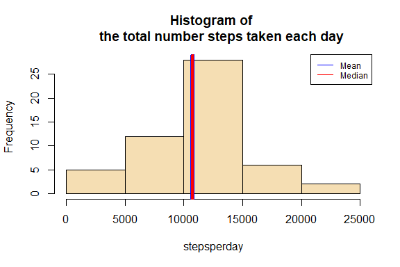

## **Loading and preprocessing the data**

The following code unzip and read the data

```r
unzip(zipfile="activity.zip")
data <- read.csv("activity.csv")
```

In order to achieve better manipulation of the data is required to make some transformations. First, we change the class of the date variable, then, using this variable we create a new factor variable that only shows the day of the observation 


```r
data$date <- as.Date(data$date)
```


## **What is mean total number of steps taken per day?**     

With the tapply function we get a vector in which each element is the total number of steps taken each day of the two months


```r
stepsperday <-tapply(data$steps, data$date, sum)
```

Then, with the hist function we can make an histogram of the total number of steps taken each day 


```r
hist(stepsperday, col = "wheat", main = "Histogram of 
     the total number steps taken each day")
abline(v = mean(stepsperday, na.rm =TRUE), col = "blue", lwd = 4)
abline(v = median(stepsperday, na.rm =TRUE), col = "red", lwd = 4)
legend("topright", lty = 1, col = c("blue","red"), 
       legend = c("Mean", "Median"),
       cex = 0.75)
```



As you can see, the blue and the read lines represents the mean and the median, resrespectively.


```r
mean <- mean(stepsperday, na.rm = TRUE) 
median <- median(stepsperday, na.rm = TRUE)
mean
```

```
## [1] 10766.19
```

```r
median
```

```
## [1] 10765
```

The mean is 1.0766189\times 10^{4} and the median 10765.

  
## **What is the average daily activity pattern?**   

With the tapply function, we get a vector in which each element is the average  number of steps (across all days) taken in each 5-minute average.


```r
avstepsinterval  <-tapply(data$steps, data$interval, mean, na.rm =TRUE)
```

With this vector we can plot a time series that shows the daily pattern activity

```r
par(mar=c(4,6,4,4))
plot(names(avstepsinterval),avstepsinterval, type = "l", ylab = "average steps
     across all the days", xlab = "5-minute interval", main ="Daily 
     pattern activity")
```


As we can see, there is a significant peak somewhere between the intervals 600 and 1000. 

```r
maxinte <- names(avstepsinterval)[which.max(avstepsinterval)]
maxinte
```

```
## [1] "835"
```

So the 5-minute interval that contains the maximum number of steps, the peak in the plot, is 835


## **Imputing missing values**   
 
The original dataset have some missing observations. This can induce bias in some calculations
 

```r
numnas <- sum(is.na(data))
numnas
```

```
## [1] 2304
```

there are 2304 missing values.


With an imput strategy we can fill all the missing values. In the following code chunk a create a new dataset (identical to the original) *dataimpute* and use a foor loop to assign to each missing value of the new dataset the mean of the corresponding 5-minute interval.


```r
dataimpute <- data
for (i in seq_along(dataimpute$steps)) {
        if (is.na(dataimpute$steps[i])){
                dataimpute$steps[i] <- avstepsinterval[dataimpute$interval[i] ==                            names(avstepsinterval)]
        }
}
```


```r
sum(is.na(dataimpute))
```

```
## [1] 0
```

We can see that in *dataimpute* there are 0 missing values

With this new dataset we proceed to make an histogram of the total number of steps taken each day 


```r
stepsperdaynew <-tapply(dataimpute$steps, dataimpute$date, sum)
hist(stepsperdaynew, col = "wheat", main = "Histogram of 
     the total number steps taken each day")
abline(v = mean(stepsperdaynew), col = "blue", lwd = 6)
abline(v = median(stepsperdaynew), col = "red", lwd = 4)
legend("topright", lty = 1, col = c("blue","red"), 
       legend = c("Mean", "Median"),
       cex = 0.75)
```


```r
meannew <- mean(stepsperdaynew) 
medianew <- median(stepsperdaynew)
meannew
```

```
## [1] 10766.19
```

```r
medianew
```

```
## [1] 10766.19
```

The mean is 1.0766189\times 10^{4} and the median 1.0766189\times 10^{4}.

As we can see in the histogram, the main impacts of imputing the missing data is that the median and the mean fully equalize and the form distribution gets more symmetric.


## **Are there differences in activity patterns between weekdays and weekends?**


```r
dataimpute$day <- as.factor(weekdays(dataimpute$date))
dataimpute$weektype <- ifelse(dataimpute$day %in% c("sábado","domingo"),
                              "weekend", "weekday")
```


```r
install.packages("lattice")
```

```
## Warning: package 'lattice' is in use and will not be installed
```

```r
library(lattice)
library(dplyr)
```


```r
subdata <- dataimpute  %>% group_by(weektype, interval)  %>% summarise(meansteps = mean(steps))
```

```
## `summarise()` regrouping output by 'weektype' (override with `.groups` argument)
```

```r
xyplot(meansteps ~ interval | weektype,
       data = subdata,
       xlab = "5-minute interval", 
       ylab = "average steps across all the days",
       type ="l",
       lwd= 2,
       layout = c(1, 2),
       main = "Daily pattern activity - Difference between weekdays and 
       weekends"
)
```

<!-- -->
